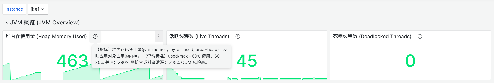
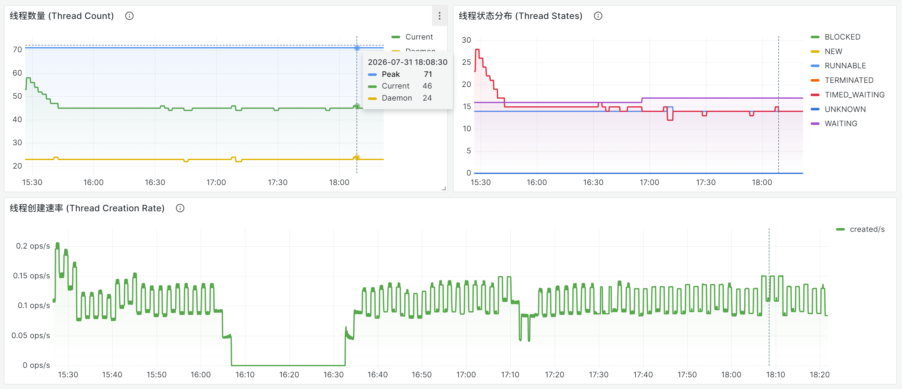
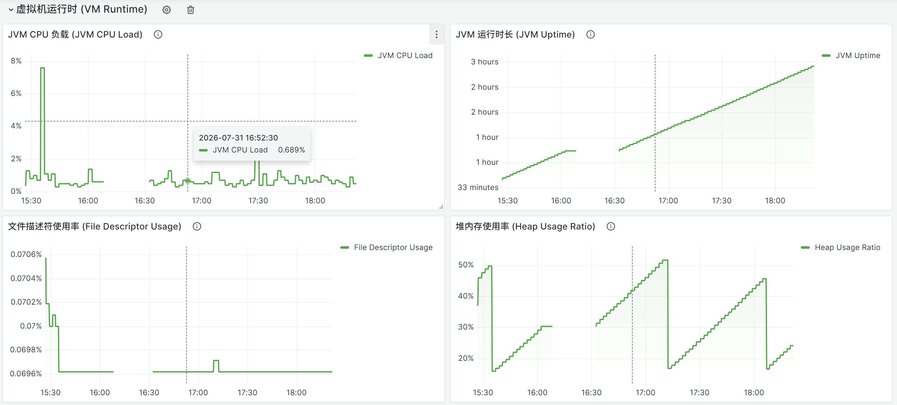

# Jenkins JVM 监控仪表板设计与实践

<!--more-->
> 目标：为 Jenkins（CI/CD 控制器）建立一套可观测的 JVM 运行时监控，覆盖内存、GC、线程、类加载、运行时资源五大维度，既能一眼看总体健康，又能下钻定位异常。
> 本笔记记录「怎么从零设计这套监控」，而非某次操作流水账，可直接照此搭建或迁移到其他 JVM 服务。

## 一、整体链路

```
Jenkins (插件暴露 /prometheus)
       │ jvm_* + vm_* 指标
       ▼
Prometheus  (按 metrics_path 抓取，多实例靠 label 区分)
       ▼
Grafana  (数据源 = Prometheus；模板变量 $instance 切换实例)
```

- **指标来源**：Jenkins 安装 Prometheus metrics 插件后，在 `/prometheus` 端点暴露 `jvm_*`（JVM JMX 指标，内存/GC/线程/类加载）与 `vm_*`（Dropwizard VM 指标，CPU/FD/uptime/heap 比率）两族指标。两者都带 `instance` 标签，可合并使用。
- **数据源**：Grafana 里建一个名为 `Prometheus` 的数据源（按名称引用，不要按 uid，避免迁移时 uid 失配）。Docker 部署 Grafana 时 URL 用 `host.docker.internal:9090`，宿主机直连用 `localhost:9090`。
- **多实例切换**：仪表板顶部放模板变量 `$instance = label_values(jvm_info, instance)`，开启 `multi + includeAll`、`allValue=".*"`，所有面板查询带 `instance="$instance"` 过滤。新增 Jenkins target 后下拉自动列出。

<!--more-->

## 二、如何提炼指标

抓取端点一个服务就能吐出上百个指标名，实测本端点暴露 **52 个 `jvm_*` + 349 个 `vm_*` = 401 个指标名**，不能全堆上去。需要提炼。

**为什么 401 个里只选 24 个？**
- `vm_*` 大量是**预聚合窗口变体**（`_history` / `_window_5m` / `_window_15m` / `_window_1h` / `_x100`），与 Grafana 自己用 `rate()` 算的速率重复，选基础量即可。
- `vm_memory_pools_*` 是**按池拆分**的变体（G1 Eden/Old/Survivor/Metaspace/CodeHeap…），已被 `jvm_memory_pool_bytes_*` 覆盖。
- `jvm_*` 存在**重复命名**（如 `jvm_threads_current` 与 `jvm_threads_live_threads`、`jvm_memory_bytes_used` 与 `jvm_memory_used_bytes`），选其一。
- 去重后**精选 24 个核心指标**，覆盖五大维度，每个都配评价标准。

**提炼四步法：**
1. **定维度**，按 JVM 子系统划「要看什么」：内存 / GC / 线程 / 类加载 / 运行时资源。
2. **选类型**，看当前状态用 gauge；看趋势用 `rate(counter)[5m]`；看健康度优先比率（0~1）而非裸字节。
3. **去重聚合**，同类信号选代表（线程状态用一个 bargauge 汇总，不为每状态画一条线）；相关绝对量合并到一张图加系列名（堆 Used/Committed/Max 三条线对比上限）。
4. **配评价标准**，能量化的给阈值（比率类 0.8/0.9 三段）；不能量化的给定性判据（死锁 >0 即严重；BLOCKED 高 = 锁竞争）。

> 时间窗口统一用 `[5m]`，不要裸用 `$__rate_interval`（部分版本下 Prometheus 会 400）。

## 三、指标清单 · 解释 · 评价标准（24 个）

> 下列为仪表板实际监控的 24 个核心指标，按维度分组。`$instance` 为模板变量，实际查询均带 `instance="$instance"` 过滤。

### 3.1 内存（9 个）

| 指标 | 类型 | 含义 | PromQL | 评价标准 |
|------|------|------|--------|---------|
| `jvm_memory_bytes_used` | gauge | 已用内存（heap/nonheap） | `jvm_memory_bytes_used{area="heap"}` | 配合 max 看使用率，逼近上限即告警 |
| `jvm_memory_bytes_committed` | gauge | JVM 已向 OS 申请的内存 | `jvm_memory_bytes_committed{area="heap"}` | committed 持续上涨 → 堆在扩张 |
| `jvm_memory_bytes_max` | gauge | 内存上限 | `jvm_memory_bytes_max{area="heap"}` | 警戒线；Used→Max 距离越小越危险 |
| `jvm_memory_pool_bytes_used` | gauge | 各内存池已用（Eden/Old/Metaspace…） | `jvm_memory_pool_bytes_used` | Old 池逼近上限 → GC 压力前兆 |
| `jvm_memory_pool_bytes_max` | gauge | 各内存池上限 | `jvm_memory_pool_bytes_max` | 与 used 对比看各池余量 |
| `jvm_memory_pool_allocated_bytes_total` | counter | 累计分配字节数 | `rate(jvm_memory_pool_allocated_bytes_total[5m])` | 分配速率突增 → 可能触发频繁 GC |
| `jvm_buffer_pool_used_bytes` | gauge | 直接内存缓冲池已用 | `jvm_buffer_pool_used_bytes` | 对比 capacity，看堆外内存 |
| `jvm_buffer_pool_capacity_bytes` | gauge | 缓冲池容量 | `jvm_buffer_pool_capacity_bytes` | 作为缓冲池上限警戒 |
| `vm_memory_heap_usage` | gauge | 堆使用率（0~1） | `vm_memory_heap_usage` | **<0.8 健康 / 0.8~0.9 告警 / >0.9 危险** |

### 3.2 垃圾回收 GC（2 个）

| 指标 | 类型 | 含义 | PromQL | 评价标准 |
|------|------|------|--------|---------|
| `jvm_gc_collection_seconds_count` | counter | GC 累计次数 | `rate(jvm_gc_collection_seconds_count[5m])` | 频率突升 = 频繁 GC，分配压力大 |
| `jvm_gc_collection_seconds_sum` | counter | GC 累计停顿时长 | `rate(jvm_gc_collection_seconds_sum[5m])` | 停顿占比高 → 影响响应/吞吐 |

> 按 `gc` 标签区分收集器（如 G1 Young/Old），可分别看或汇总。

### 3.3 线程（7 个）

| 指标 | 类型 | 含义 | PromQL | 评价标准 |
|------|------|------|--------|---------|
| `jvm_threads_current` | gauge | 活跃线程数 | `jvm_threads_current` | 与基线对比，突增/突降即异常 |
| `jvm_threads_daemon` | gauge | 守护线程数 | `jvm_threads_daemon` | 一般稳定，参考用 |
| `jvm_threads_peak` | gauge | 峰值线程数 | `jvm_threads_peak` | 参考最大并发承载 |
| `jvm_threads_state` | gauge | 各状态线程数 | `jvm_threads_state{state="BLOCKED"}` | **BLOCKED 高 = 锁竞争**；WAITING 异常高 = 资源等待 |
| `jvm_threads_deadlocked` | gauge | 死锁线程数（循环依赖） | `sum(jvm_threads_deadlocked or vector(0))` | **>0 即严重** |
| `jvm_threads_deadlocked_monitor` | gauge | 死锁线程数（监视器） | `sum(jvm_threads_deadlocked_monitor or vector(0))` | **>0 即严重** |
| `jvm_threads_started_total` | counter | 累计启动线程数 | `rate(jvm_threads_started_total[5m])` | 创建速率持续高 = 线程池未复用/泄漏 |

> 死锁面板把两个死锁指标合并：`(sum(jvm_threads_deadlocked or vector(0)) + sum(jvm_threads_deadlocked_monitor or vector(0)))`。
> 注意：活跃线程数用 `jvm_threads_current`，不要用 `jvm_threads_live_threads`（重复命名，后者无数据）。

### 3.4 类加载（3 个）

| 指标 | 类型 | 含义 | PromQL | 评价标准 |
|------|------|------|--------|---------|
| `jvm_classes_currently_loaded` | gauge | 当前已加载类数 | `jvm_classes_currently_loaded` | 持续上涨 → 可能类/类加载器泄漏 |
| `jvm_classes_loaded_total` | counter | 累计加载类总数 | `jvm_classes_loaded_total` | 配合卸载数看加载 churn |
| `jvm_classes_unloaded_total` | counter | 累计卸载类总数 | `jvm_classes_unloaded_total` | 卸载频繁 → 动态类/热部署，关注 Metaspace |

> 注意区分：`jvm_classes_currently_loaded`（gauge，当前值）与 `jvm_classes_loaded_total`（counter，累计值）是两个不同指标，别混用。

### 3.5 运行时资源（3 个 + jvm_info）

| 指标 | 类型 | 含义 | PromQL | 评价标准 |
|------|------|------|--------|---------|
| `vm_cpu_load` | gauge | JVM 进程 CPU 负载（0~1） | `vm_cpu_load` | **<0.8 / 0.8~0.9 / >0.9** |
| `vm_file_descriptor_ratio` | gauge | 文件描述符使用率（0~1） | `vm_file_descriptor_ratio` | 接近 1 → 可能打不开文件/连接 |
| `vm_uptime_milliseconds` | gauge | 进程运行时长 | `vm_uptime_milliseconds` | 参考稳定性；异常低 = 重启过 |
| `jvm_info` | info | JVM 版本信息（常量 1） | `jvm_info` | 不做图，仅用于 `label_values(jvm_info, instance)` 取实例列表 |

> `vm_memory_heap_usage` 既出现在内存区（timeseries 趋势）也出现在资源占比区（gauge 仪表），是同一指标两种展示。

### 3.6 端点全量指标说明（未监控的为何不选）

端点共 401 个指标名，除上述 24 个外，其余主要分四类，均**刻意不选**：
- **预聚合窗口变体**：`vm_*_history` / `vm_*_window_5m` / `_15m` / `_1h` / `_x100`，与 Grafana `rate()` 重复。
- **按池拆分变体**：`vm_memory_pools_<池名>_*`（G1 Eden/Old/Survivor/Metaspace/CodeHeap…），已被 `jvm_memory_pool_bytes_*` 覆盖。
- **重复命名**：`jvm_threads_live_threads` / `jvm_memory_used_bytes` / `jvm_classes_loaded_classes` 等，与所选指标同义，选其一避免冗余。
- **GC pause 细分**：`jvm_gc_pause_seconds_*` / `jvm_gc_live_data_size_bytes` / `jvm_gc_max_data_size_bytes` / `jvm_gc_overhead_percent`，进阶 GC 分析用，本版未纳入，需要时可加。

## 四、如何配置 Prometheus 采集

### 4.1 Jenkins 侧
1. 安装 **Prometheus metrics plugin**（`org.jenkins-ci.plugins:prometheus`）。
2. 插件默认在 `http://<jenkins>/prometheus` 暴露指标（含 `jvm_*` 与 `vm_*`）。
3. （可选）在插件配置页调整暴露的指标范围；如需鉴权，配置允许的路径/认证。

### 4.2 Prometheus 侧（prometheus.yml）
单实例：
```yaml
scrape_configs:
  - job_name: jenkins
    metrics_path: /prometheus
    static_configs:
      - targets: ['jenkins-1:8080']
        labels:
          instance: jks1
```

多实例（同一 `metrics_path`，靠 `instance` label 区分）：
```yaml
scrape_configs:
  - job_name: jenkins
    metrics_path: /prometheus
    static_configs:
      - targets: ['jenkins-1:8080']
        labels:
          instance: jks1
      - targets: ['jenkins-2:8080']
        labels:
          instance: jks2
```
> 也可用 `relabel_configs` 把 `__address__` 重写为业务名做 `instance`。

### 4.3 验证采集
- Prometheus `/targets` → 对应 job `health=up`
- `curl http://prometheus:9090/api/v1/query?query=up{job="jenkins"}` → 值为 1
- `curl http://jenkins:8080/prometheus | grep '^jvm_'` → 看暴露了哪些指标名
- Grafana 数据源代理：`/api/datasources/proxy/<id>/api/v1/query?query=...` 直接查某指标

## 五、如何设计仪表板

### 5.1 分区设计原则
- **按子系统分 row**，从上到下：概览 → 内存 → GC → 线程 → 类加载 → 运行时 → 比率仪表 → 分布。
- **信息密度递减**：顶部是最重要的「总览快照」，下面是趋势细节与分布。
- 每个分区用 `row` 收纳，折叠/展开可控；分区标题用「中文(英文)」双语便于检索。

**分区方案（9 个 row，24 个数据面板）：**
1. JVM 概览 — 3 个 stat 单值快照（堆内存使用量、活跃线程数、死锁数）
2. 内存使用 — 堆趋势 / 非堆趋势 / 内存池 / 分配速率（4 个 timeseries）
3. 直接内存/缓冲池 — 缓冲池 Used vs Capacity（1 个 timeseries）
4. 垃圾回收 — 频率 / 停顿（2 个 timeseries）
5. 线程 — 数量 / 状态分布 / 创建速率（3 个 timeseries）
6. 类加载 — 当前已加载 / 累计加载 / 累计卸载（3 个 timeseries）
7. 虚拟机运行时 — CPU / 运行时长 / FD / 堆使用率（4 个 timeseries）
8. 资源占比（Gauge） — 堆/FD/CPU 三个比率仪表（3 个 gauge）
9. 线程状态分布（Bar gauge） — 各状态横向条形（1 个 bargauge）

### 5.2 Panel 类型选择

| 类型 | 适用场景 | 本仪表板用法 |
|------|---------|-------------|
| **stat** | 单值快照，一眼知总体状态 | 概览区：堆内存使用量、活跃线程数、死锁数 |
| **timeseries** | 随时间变化的趋势，看异常时段 | 内存/GC/线程/类加载/运行时的所有趋势面板 |
| **gauge** | 比率/百分比，直观判断是否越线 | CPU/FD/堆使用率（弧形 + 阈值着色） |
| **bargauge** | 多类别占比对比 | 线程状态分布（各状态横向条形） |

> 选型原则：状态量用 stat、趋势用 timeseries、比率用 gauge、分布用 bargauge。**不为炫技堆面板**，类型要与信息目的匹配。

### 5.3 布局（24 列网格）

- 全部面板基于 24 列网格（`gridPos`：x/y/w/h）。
- 概览区 stat：3 个并排，各占 **8 宽**，占满首行。
- 趋势 timeseries：**12 宽**（两个并排）或 **24 宽**（整行大图），高度 8。
- 比率 gauge：3 个并排各 8 宽，与概览区呼应。
- bargauge：24 宽整行，展开各状态对比。
- row 用 `h=1` 作分隔条；面板靠 `y` 顺序自上而下排（扁平 panels 列表，row 不嵌套子面板）。

### 5.4 视觉规范（科技审美）

| 维度 | 设置 | 理由 |
|------|------|------|
| 主题 | `dark` 深色 | 暗底高对比，长时间盯不累 |
| 十字线 | `graphTooltip=1` 共享 | 多图同时间对齐，定位异常时段 |
| 折线 | `lineWidth=2` + `fillOpacity=10` + `gradientMode=opacity` + `smooth` + `showPoints=never` | 淡填充 + 渐变，质感而非糊 |
| 图例 | 右侧、`calcs=[]`（无数值表） | 不遮挡图形主体 |
| Tooltip | `mode=multi` + `sort=desc` | 多系列同时对比 |
| 阈值线 | 比率面板加 `thresholdsStyle=lines`，画 0.8 黄 / 0.9 红 | 与 gauge 阈值呼应，一眼看越线 |
| 上限线 | 内存趋势把 `Max` 系列设红色虚线 | 「Used 逼近上限」一目了然 |
| 配色 | 健康 `#00e676` / 告警 `#ffea00` / 危险 `#ff1744` | 全局统一三段阈值色 |

> stat 单值面板配三段阈值 + 数值变色 + sparkline 迷你图，既有当前值又有近期走势。

## 六、阈值 / 评价标准总表

| 维度 | 指标 | 健康(绿) | 告警(黄) | 危险(红) |
|------|------|---------|---------|---------|
| 内存 | 堆使用率 `vm_memory_heap_usage` | <0.8 | 0.8~0.9 | >0.9 |
| CPU | `vm_cpu_load` | <0.8 | 0.8~0.9 | >0.9 |
| 文件描述符 | `vm_file_descriptor_ratio` | <0.8 | 0.8~0.9 | >0.9 |
| 死锁 | deadlocked 计数 | 0 | — | >0 |
| 线程状态 | BLOCKED 数 | 低 | 偏高 | 持续高 |
| GC | 频率/停顿 | 平稳 | 突升 | 持续高位 |

> 比率类阈值用 0~1（`percentunit`）；若 expr 显式 `*100`，则阈值改 80/90 并用 `unit=percent`。

## 七、导入与维护

- **导入方式**：Grafana HTTP API `POST /api/dashboards/db`（带 `-d @file.json`）或 UI `+ → Import` 上传 JSON。JSON 外层须为 `{"dashboard":{...}}`。
- **覆盖更新**：同 uid 覆盖会触发乐观锁，需先 `GET` 取当前 `version` 对齐 payload，或加 `?overwrite=true` 并先删旧版。
- **模板变量**：`$instance` 一处定义全局生效，新增 Jenkins target 无需改仪表板，下拉自动更新。
- **扩展**：要加新指标，遵循「先定维度→选类型→配评价标准→定布局」四步，保持分区与配色统一。
- **仪表板源文件**：已上传 GitHub `leoyim/jenkins-monitoring-dashboard`（`jenkins_jvm_monitor_v10.2.0.json`），可直接 import。

## 八、监控效果







