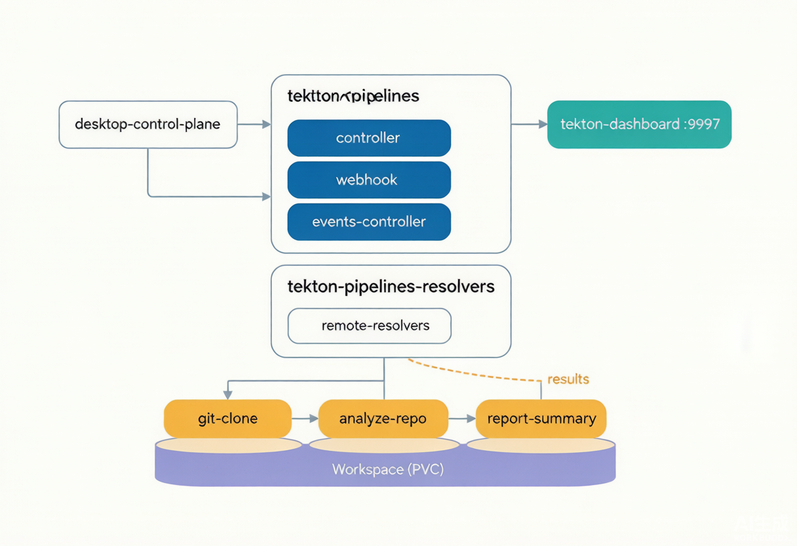
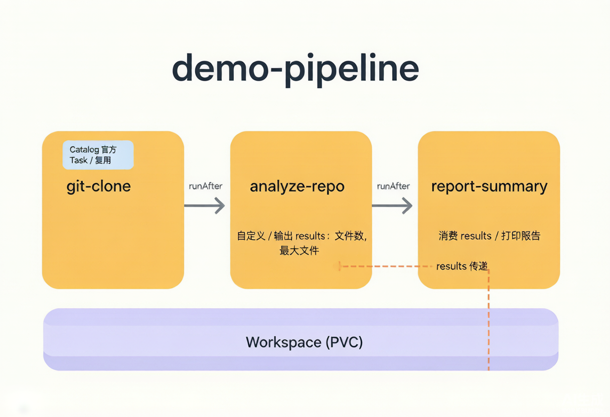

# Tekton 本地部署与实践笔记

<!--more-->
> 环境：Windows + Docker Desktop 内置 Kubernetes（kind 内核）
> 目标：在本地 K8s 上部署 Tekton，验证端到端工具链，并跑通一条能体现 Tekton 价值的示例流水线。
> 完成状态：全部验证通过 ✅

## 0. 背景与目标

本次实践要解决的是「在本地 Kubernetes 环境中把 Tekton 跑起来并验证可用」。具体验收项：

1. 安装 Tekton Pipelines 核心组件到现有集群
2. 确认所有 Tekton Pod 处于 Running
3. 验证 Tekton CLI（tkn）可连接集群并执行命令
4. 确认可通过 kubectl 访问 Tekton 的 CRD（Task / Pipeline 等）
5. 运行一个简单的 Tekton Task 验证工具链
6. （扩展）安装 Tekton Dashboard 图形界面
7. （扩展）创建一条示例流水线 `demo-pipeline` 体现 Tekton 价值

<!--more-->

## 1. 环境判定（第一个关键认知）

用户提到「已通过 kind 部署启动了 Kubernetes 集群」，但实际检测到的唯一 Kubernetes 上下文是 **`docker-desktop`**（节点名为 `desktop-control-plane`），并没有独立创建的 kind 集群，也没有 `kind` CLI。

关键证据：集群里跑着 `kindnet` 这个 CNI Pod，说明 **Docker Desktop 内置的 Kubernetes 就是用 kind 内核构建的**。

结论：Tekton 的部署命令、验证步骤与真正的 kind 集群完全一致，无需另外安装 `kind` CLI 或新建集群。直接在这个 `docker-desktop` 集群上完成全部工作即可。

## 2. 部署 Tekton Pipelines v1.6.0

通过官方发布清单一键部署：

```bash
kubectl apply -f https://storage.googleapis.com/tekton-releases/pipeline/latest/release.yaml
```

- 部署到命名空间 `tekton-pipelines` 与 `tekton-pipelines-resolvers`
- 核心镜像来自 `ghcr.io/tektoncd/pipeline/*`（在本机网络下可正常拉取）
- 包含 8 个 CRD，以及 `tekton-pipelines-controller`、`tekton-pipelines-webhook`、`tekton-pipelines-resolvers` 等核心组件



> 图 1：本地 Tekton 部署架构总览（组件与命名空间示意；Dashboard 实际端口为 `9097`）。

## 3. 安装 Tekton CLI（tkn）v0.45.0

从 GitHub Releases 下载 Windows 版压缩包，解压 `tkn.exe` 到 `C:\Users\leoya\bin`（该目录已在 PATH 中）。

踩到的网络坑：GitHub API（`api.github.com`）被限流返回 403，无法直接拿到最新版本号。改用「探测候选版本号 + 直接 GET 下载」的方式，慢网下用 `curl -C -` 断点续传，最终成功拉取并校验 `v0.45.0`。

验证：

```bash
tkn version
# Client version: 0.45.0
# Pipeline version: v1.6.0
```

## 4. 五项验收验证（全部通过 ✅）

| 验收项 | 结果 | 说明 |
|--------|------|------|
| Tekton Pod 状态 | ✅ | 4/4 Running & Ready（controller / webhook / events-controller / remote-resolvers） |
| tkn 连接集群 | ✅ | `tkn version` 显示 Client 0.45.0 / Pipeline v1.6.0，可正常查询 |
| CRD 可访问 | ✅ | 8 个 `tekton.dev` CRD（tasks / taskruns / pipelines / pipelineruns / customruns / stepactions / verificationpolicies / resolutionrequests）均注册可读 |
| 示例 Task | ✅ | `hello-task` 的 TaskRun **Succeeded**，输出正确 |
| Dashboard（扩展） | ✅ | v0.71.0 已装，http://localhost:9097 可访问 |

## 5. 踩坑与修复：cgr.dev 镜像拉取失败

这是本次最值得记录的一个问题。

**现象**：首次运行 Task 时，Pod 卡在 `ContainerCreating` / `ImagePullBackOff`，报错 `unexpected EOF`。定位到是 Tekton 注入的 `place-scripts` 初始化容器在拉取 `cgr.dev/chainguard/busybox` 时，本机网络对该 registry 不稳定导致传输中断。

**根因**：控制器 Deployment 的 `-shell-image` 参数（args 索引 9）默认硬编码为 `cgr.dev/chainguard/busybox`，这个镜像被所有 Task 的 `place-scripts` 初始化容器依赖，也就是说**哪怕你用 `command`/`args` 写 Task，也绕不开它**。

**修复**：把 `-shell-image` 改为网络更稳定的 `docker.io/library/busybox:1.36.1`，再滚动重启控制器：

```bash
kubectl patch deployment tekton-pipelines-controller -n tekton-pipelines \
  --type=json \
  -p='[{"op":"replace","path":"/spec/template/spec/containers/0/args/9","value":"docker.io/library/busybox:1.36.1"}]'

kubectl rollout restart deployment/tekton-pipelines-controller -n tekton-pipelines
```

重启后 Task 立即恢复正常。

**教训**：遇到 `place-scripts` 拉取 busybox 失败，不要去改 Task 写法，要从控制器 `-shell-image` 入手。

## 6. 安装 Tekton Dashboard（图形界面）

Tekton 默认没有图形界面，需要单独安装 Dashboard。

注意：官方文档里的 `storage.googleapis.com/tekton-releases/dashboard/latest/...` 路径目前已返回 404，需改用 GitHub Release 资产：

```bash
kubectl apply -f https://github.com/tektoncd/dashboard/releases/download/v0.71.0/release.yaml
```

- 部署到 `tekton-pipelines`，Service 名为 `tekton-dashboard`，端口 `9097`
- 镜像来自 `ghcr.io/tektoncd/dashboard/*`，无 cgr.dev 依赖，可正常拉取
- 启动端口转发（后台运行）：

```bash
kubectl port-forward -n tekton-pipelines svc/tekton-dashboard 9097:9097
```

浏览器访问 **http://localhost:9097** 即可看到 Pipeline / Task / TaskRun 等资源的图形界面。若转发随终端会话断开，重跑上面那条命令即可恢复。

## 7. 示例流水线 demo-pipeline（体现价值）

为了真正体现 Tekton 的价值，而不是只跑一个 `echo`，我创建了一条由三个 Task 组成的流水线：

```
git-clone  →  analyze-repo  →  report-summary
 (Catalog)      (自定义)          (自定义)
```

- **clone**：直接复用 Tekton Catalog 官方 `git-clone` Task，把仓库克隆进 Workspace
- **analyze**：自定义 Task，统计仓库文件数并找出最大文件，把结果写入 `results`
- **report**：自定义 Task，消费上游 `results` 打印汇总报告



> 图 2：demo-pipeline 流程图，演示 Task 复用、Workspace 共享、runAfter 编排与 Results 传递。

这条流水线集中体现了 Tekton 的六大价值点：

1. **可复用 Task**：官方 `git-clone` 直接从 Catalog 引入，不重复造轮子
2. **Workspace**：用 `volumeClaimTemplate` 自动创建/回收 1Gi PVC，跨三个 Task 共享同一份代码
3. **Pipeline DAG**：用 `runAfter` 显式声明依赖（克隆完成才开始分析）
4. **Parameters**：仓库地址、业务消息参数化，一套流水线跑任意仓库
5. **Results 传递**：`analyze` 算出的「文件数 / 最大文件」通过 `$(tasks.analyze.results.*)` 解耦传给 `report`
6. **K8s 原生 CRD**：全部是 Pipeline/Task/TaskRun/PipelineRun 资源，没有 Jenkins 那样的中心化 CI Master

两个 PipelineRun 均 `Succeeded`，报告正确输出：`仓库 https://github.com/octocat/Hello-World.git` · `文件总数 24` · `最大文件 ./.git/hooks/pre-rebase.sample` · 状态成功 ✅。

**这一节又踩了两个小坑**：
- 多文档 YAML 必须用 `---` 分隔，否则 `kubectl apply` 只会解析最后一个文档（最初漏写 `---`，导致两个自定义 Task 没被创建，只建了 Pipeline）
- Alpine/busybox 的 `find` 不支持 `-printf`，统计最大文件改用 `find -exec stat -c '%s %n' {} + | sort -rn`

## 8. 命令速查

```bash
# 部署核心组件
kubectl apply -f https://storage.googleapis.com/tekton-releases/pipeline/latest/release.yaml

# 查看 Tekton Pod
kubectl get pods -n tekton-pipelines -o wide

# tkn 查询
tkn task list
tkn pipelinerun list
tkn pipelinerun logs <name>

# 修复 cgr.dev 镜像问题
kubectl patch deployment tekton-pipelines-controller -n tekton-pipelines --type=json \
  -p='[{"op":"replace","path":"/spec/template/spec/containers/0/args/9","value":"docker.io/library/busybox:1.36.1"}]'
kubectl rollout restart deployment/tekton-pipelines-controller -n tekton-pipelines

# Dashboard 端口转发
kubectl port-forward -n tekton-pipelines svc/tekton-dashboard 9097:9097
```

## 9. 后续可扩展方向

- **并行执行**：在一条 Pipeline 里同时跑 lint / test / build（体现 Tekton 的并行 DAG 能力）
- **条件分支**：用 `when` 表达式，仅在 `main` 分支执行部署 Task
- **构建镜像**：接入 Kaniko Task，把代码构建成镜像并推送到镜像仓库
- **事件触发**：安装 Tekton Triggers，用 Git Webhook 自动触发流水线

## 10. 本地恢复与运维（2026-08-20 补充）

> 本章记录重启 Docker Desktop 后的排障、一键恢复脚本、WSL2 迁移，以及 Dashboard 只读问题修复。

### 10.1 重启 Docker Desktop 后 Tekton「消失」的真相

**现象**：重启 Docker Desktop 后，用 `docker ps -a` 看不到任何「tekton」实例，以为 Tekton 丢了。

**真相**：Tekton 从来不是 Docker 容器，它是跑在 Docker Desktop 内置 Kubernetes（`docker-desktop` 集群）里的 K8s 工作负载（Deployment / Pod / CRD）。`docker ps -a` 只列 Docker Engine 直接管理的容器，Tekton 组件不会以「tekton」名字出现，所以「看不到」是**查看工具用错了**，不是真的消失。

实测诊断（WSL2 / Git Bash 直连本机集群）：

| 检查项 | 结果 |
|--------|------|
| 集群 `docker-desktop` | Ready（节点 `desktop-control-plane`） |
| `tekton-pipelines` 命名空间 | Active |
| 4 个 Pod（controller/webhook/events/dashboard） | 全 `1/1 Running`（随 Docker 重启一起重启过） |
| `-shell-image` 补丁 | 仍持久化为 `docker.io/library/busybox:1.36.1` |
| tkn / Pipeline / Dashboard | 0.45.0 / v1.6.0 / v0.71.0 |
| 8 个 tekton.dev CRD | 齐全 |

> 结论：本地 docker-desktop K8s 正常重启后会自动恢复状态（Pod 重启但会回来）。如果哪天真「全没了」（命名空间都没了），那是集群被 **Reset / 自动更新重建 VM / K8s 开关被关再开**，属于硬重置，需要重新部署。

**正确的查看命令**（别再用 `docker ps -a`）：

```bash
kubectl get pods -n tekton-pipelines -o wide
kubectl get ns
kubectl config current-context      # 应为 docker-desktop
kubectl get nodes
```

### 10.2 一键恢复脚本 + WSL2 迁移

裸 `kubectl apply` 远程 URL 的方案，一旦集群被硬重置就一切归零。因此把恢复流程固化为脚本，并迁入 WSL2 Ubuntu（跑 kubectl 比走 `/mnt/d` 更快）：

脚本位置（WSL2）：`/home/leoyim/tekton/`

- `tekton-install.sh`：幂等恢复，切 `docker-desktop` 上下文 → 下载并 apply Pipeline + Dashboard 清单（缓存到 `manifests/`）→ 自动 patch `-shell-image` → rollout restart → 等待就绪
- `tekton-forward.sh`：Dashboard 端口转发到 `localhost:9097`
- `demo-pipeline.yaml`：按第 7 节重建的示例流水线

Windows 源副本仍在 `D:\Project\NoteBook\05Tekton\`（备份 + 与笔记同目录）。

WSL2 内 kubectl 位于 `/usr/local/bin/kubectl`，上下文即 `docker-desktop`，脚本可直接运行。

```bash
# WSL2 终端
cd ~/tekton
bash tekton-install.sh     # 集群被硬重置时一键还原（平时可跳过，纯验证用）
bash tekton-forward.sh     # 另开终端：转发 Dashboard，浏览器开 http://localhost:9097
```

> 注意：Dashboard 默认是**只读部署**（见 10.3），`tekton-install.sh` 目前只还原「能看」，如需界面可写，恢复后再跑 10.3 的两步。

### 10.3 Dashboard 只读模式与修复（UI 可写）

**现象**：Dashboard 界面顶部提示 Read Only，不能从网页创建/编辑/删除资源。

**根因**：Tekton Dashboard 官方 release 默认就是只读部署，由「标志位 + RBAC」双重控制：

- 部署参数含 `--read-only=true`（args 索引 8）
- `tekton-dashboard` ServiceAccount 只绑定 `*-view`（只读）ClusterRole，无任何 edit 绑定

> 只读**只影响网页 UI 写操作**；终端 `kubectl`/`tkn`（docker-desktop kubeconfig 是集群管理员）始终是全读写，用 `kubectl apply` 跑 `demo-pipeline.yaml` 不受影响。

**改为可写（两步缺一不可）**：

① 给 `tekton-dashboard` SA 加 edit 权限：

```bash
kubectl apply -f - <<'EOF'
apiVersion: rbac.authorization.k8s.io/v1
kind: ClusterRole
metadata:
  name: tekton-dashboard-edit
rules:
  - apiGroups: ["tekton.dev"]
    resources: ["*"]
    verbs: ["get","list","watch","create","update","patch","delete"]
  - apiGroups: [""]
    resources: ["pods","pods/log","configmaps","secrets","persistentvolumeclaims","services"]
    verbs: ["get","list","watch","create","update","patch","delete"]
  - apiGroups: ["batch"]
    resources: ["jobs"]
    verbs: ["*"]
---
apiVersion: rbac.authorization.k8s.io/v1
kind: ClusterRoleBinding
metadata:
  name: tekton-dashboard-edit-binding
roleRef:
  apiGroup: rbac.authorization.k8s.io
  kind: ClusterRole
  name: tekton-dashboard-edit
subjects:
  - kind: ServiceAccount
    name: tekton-dashboard
    namespace: tekton-pipelines
EOF
```

② 把 `--read-only=true` 改为 `false` 并重启：

```bash
kubectl patch deployment tekton-dashboard -n tekton-pipelines --type=json \
  -p='[{"op":"replace","path":"/spec/template/spec/containers/0/args/8","value":"--read-only=false"}]'
kubectl rollout restart deployment/tekton-dashboard -n tekton-pipelines
```

刷新 http://localhost:9097，Read Only 提示消失即生效。该改动存于 etcd，Pod 重启不丢；但**集群被硬重置后会回来**，届时需要重跑这两步（或把它并进 `tekton-install.sh`）。

### 10.4 demo-pipeline.yaml 重建

原笔记第 7 节只有流程描述、没存完整清单。已按第 7 节重建 `demo-pipeline.yaml`（`git-clone → analyze-repo → report-summary`），放 `~/tekton/` 与 `D:\Project\NoteBook\05Tekton\`。

首次跑前需先装官方 `git-clone` Catalog Task：

```bash
kubectl apply -f https://raw.githubusercontent.com/tektoncd/catalog/main/task/git-clone/0.9/git-clone.yaml
kubectl apply -f demo-pipeline.yaml
```

## 附录：关键经验教训清单

- Docker Desktop 内置 K8s = kind 内核，Tekton 部署方式与真 kind 一致
- `cgr.dev/chainguard/busybox` 在本机网络不稳定 → 改 `docker.io/library/busybox:1.36.1`
- `place-scripts` 注入无法用 `command`/`args` 绕过，必须从 `-shell-image` 解决
- Dashboard 的 `latest` 下载路径已 404，改用 GitHub Release 资产
- 多文档 YAML 必须加 `---`
- busybox `find` 不支持 `-printf`，用 `stat` 替代
- **Tekton 是 K8s 工作负载，不归 `docker ps` 管**，用 `docker ps -a` 永远看不到「tekton」，正确查看用 `kubectl get pods -n tekton-pipelines`
- 重启 Docker Desktop 后 Tekton 通常自动恢复；真「全没了」= 集群硬重置（Reset / 自动更新重建 VM / K8s 重开），用 `tekton-install.sh` 一键还原
- 恢复/运维脚本已迁入 WSL2 `/home/leoyim/tekton/`（`tekton-install.sh` / `tekton-forward.sh` / `demo-pipeline.yaml`），Windows 源副本在 `D:\Project\NoteBook\05Tekton\`
- Dashboard 官方默认**只读**（`--read-only=true` 且 SA 仅绑 `*-view`），UI 想可写需加 edit ClusterRole/Binding + 把 flag 改 false（见 10.3）
- 只读只限网页 UI；终端 `kubectl`/`tkn`（docker-desktop kubeconfig=集群管理员）始终是全读写

